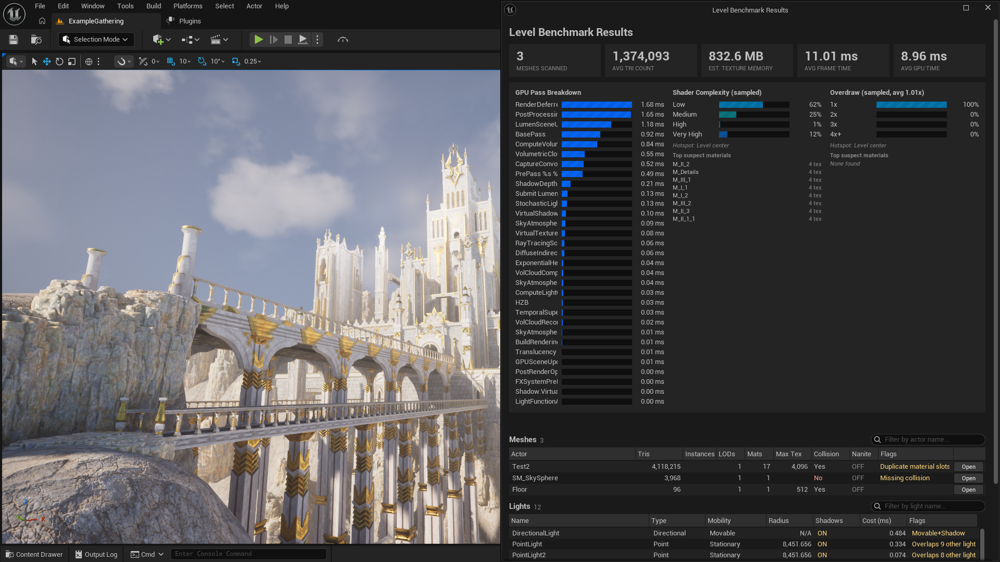
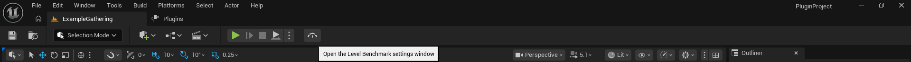
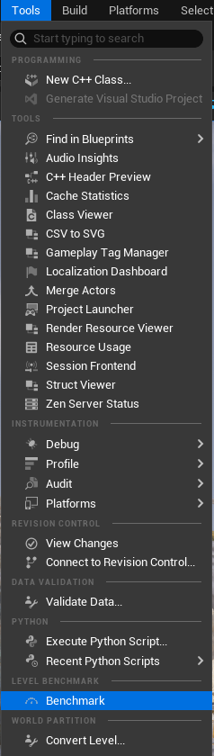
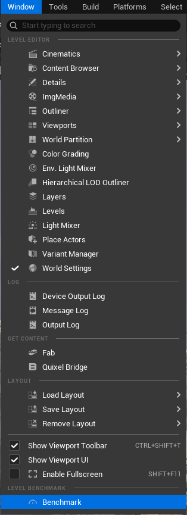
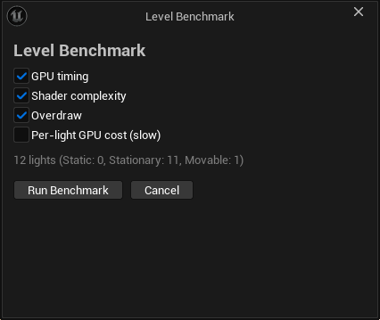
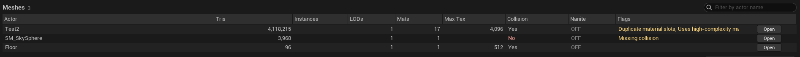
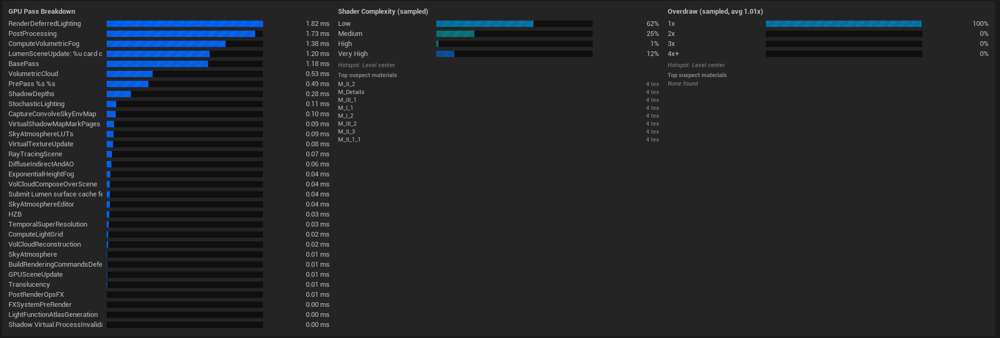
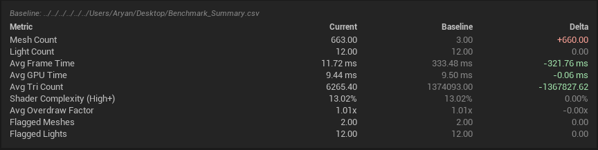

# Level Benchmark

Editor-only Unreal Engine plugin that benchmarks the currently loaded level: a synchronous static analysis pass (meshes, landscapes, lights) combined with PIE-based GPU timing, shader complexity, overdraw, and per-light cost passes — plus configurable budgets, CI regression gating, and a Nanite/Lumen advisor. Results are viewable in-editor and exportable to CSV for tracking across runs.

> [!WARNING]
> **Plugin is made for lowpoly/stylized games and not for flim/rendering projects that don't mind 4K Textures and overlapping lights**
>
> Note, this project doesn't really do anything other than scanning or displaying stats, so your assets should be safe. But still, **BACK UP YOUR PROJECT**.



*Benchmark ran on "White castle" by DmitriyDryzhak*

## Contents

- [Features](#features)
- [Requirements](#requirements)
- [Installation](#installation)
- [Usage](#usage)
- [Budgets & Pass/Fail](#budgets--passfail)
- [CI Regression Gating](#ci-regression-gating)
- [Console Commands](#console-commands)
- [CSV Export](#csv-export)
- [Comparing Runs](#comparing-runs)
- [Flags Reference](#flags-reference)
- [Known Limitations](#known-limitations)
- [Support](#support)

## Features

- **Static pass** (no PIE required): per-component triangle count, LOD count, material count, max texture resolution, collision state, Nanite state, and instanced-mesh-aware effective triangle counts (`UInstancedStaticMeshComponent` / HISM).
- **Landscape scan**: component count, quad count, and Nanite state per landscape proxy.
- **Light scan**: type, mobility, attenuation radius, shadow casting, pairwise overlap detection, and stationary shadow-cluster detection (shadow channel limit).
- **Material cost attribution**: top materials ranked by texture sample count and by usage among overdraw-prone blend modes, cross-referenced back into the mesh table.
- **Estimated texture memory**: real measured GPU resource size (`GetResourceSizeBytes`), deduplicated per unique texture across the level — static mesh and landscape materials both.
- **GPU pass timing** (PIE): per-pass GPU cost breakdown via the RHI breadcrumb profiler, including Lumen's specific share of frame time.
- **Shader complexity / quad overdraw** (PIE): scene captures sampled across a grid spanning the level's bounds (plus player starts), decoded against the engine's live color ramps, reported as percentage buckets with a worst-point hotspot.
- **Per-light GPU cost** (PIE, optional): isolates each shadow-casting non-static light's GPU cost by toggling it and diffing GPU time, with automatic camera placement near each light.
- **Nanite & Lumen advisor**: flags Nanite enabled on meshes too low-poly to be worth the overhead, and materials with World Position Offset connected on a Nanite mesh (extra lighting cost).
- **Texture streaming audit**: live streaming pool size and how far over budget it is, read directly from the engine's streaming manager.
- **Configurable budgets with pass/fail**: your own thresholds for tri count, GPU time, shader complexity, overdraw, and texture memory, with Mobile/Console/PC presets to start from. Every run gets a clear pass or fail verdict.
- **CI regression gating**: run headless with a baseline CSV and a regression percentage; get a non-zero exit code back if the level regressed past your threshold.
- **Run comparison**: diff the current run against a previously exported `Benchmark_Summary.csv`.
- **CSV export**: three files (meshes, lights, summary), auto-timestamped or user-chosen folder.
- Toolbar button, Tools menu entry, Window menu entry, and console commands for headless/automated runs.

## Requirements

- Unreal Engine 5.7 or 5.8.
- Windows (built and tested on Windows; other platforms untested).
- Editor-only — the plugin adds nothing to packaged builds.

## Installation

**Via Fab**

1. Purchase/acquire the plugin from its Fab listing.
2. Add it to your project through the Epic Games Launcher's Fab library, or download it directly to a project's `Plugins/` folder.
3. Open the project. If prompted to rebuild modules, accept.
4. Confirm the plugin is enabled: **Edit → Plugins → Editor**, search "Level Benchmark".

## Usage

### Opening the tool

Three equivalent entry points:

- Toolbar button (top-level editor toolbar)


- **Tools → Level Benchmark**


- **Window → Level Benchmark**



### Settings

Opening the tool shows the settings window: a live light-count estimate for the loaded level, checkboxes for which passes to run, and a collapsible "Thresholds & Budgets" section for the budget settings covered below.

| Setting | Default | Notes |
|---|---|---|
| GPU timing | On | Requires a PIE session (Sequence A). |
| Shader complexity | On | Sampled scene capture, requires PIE. |
| Overdraw | On | Sampled scene capture, requires PIE. |
| Per-light GPU cost | Off | Runs one PIE session per qualifying light. Shows a time-estimate warning above 50 lights. |



Click **Run Benchmark** to start. The static pass runs first and synchronously; its results are kept even if a later PIE pass is interrupted. PIE-based passes then run automatically — avoid manually closing PIE while a benchmark is in progress, as this is treated as an interruption (static results are still shown, with a banner and Retry option).

### Reading results

The results window opens automatically once a run finishes (or is interrupted).

- **Budget verdict banner** — green "All configured budgets passed" or a red list of failure reasons, shown whenever at least one budget threshold is configured.
- **Stat cards** — meshes scanned, average tri count, estimated texture memory, streaming pool status, and (once measured) average frame/GPU time.
- **GPU Pass Breakdown** — per-pass GPU cost as sorted bars, including a Lumen cost line where applicable.
- **Shader Complexity / Overdraw** — percentage buckets with a hotspot callout and a "top suspect materials" list.
- **Meshes / Lights / Landscapes tables** — sortable, searchable, zebra-striped. Flagged rows are color-coded. Meshes have an **Open** button to jump straight to the asset editor.



*mesh table screenshot*



*gpu breakdown and shader complexity breakdown*

## Budgets & Pass/Fail

Set your own pass/fail thresholds under the settings window's "Thresholds & Budgets" section: maximum percentage of above-average-triangle meshes, maximum GPU time, maximum shader complexity (High+) percentage, maximum overdraw factor, and maximum texture memory. Pick a **Mobile / Console / PC** preset as a starting point (placeholder values — not verified real console specs, tune them for your actual target hardware) or leave everything on **Custom** and set numbers by hand. Any field left at 0 or less is treated as disabled.

Every run evaluates your configured budgets and sets a pass/fail verdict, shown as a banner at the top of the results window. Tri-count budgeting is intentionally relative, not absolute — it's a percentage of meshes flagged "above average" for *that level's own* average, not a hand-picked triangle number, since a reasonable budget looks different level to level.

## CI Regression Gating

`LevelBenchmark.Run` accepts two optional flags for headless/CI use:

```
LevelBenchmark.Run -CompareBaseline=<path to Benchmark_Summary.csv> -FailOnRegressionPct=<N>
```

When both are supplied, the run is checked against the baseline CSV and against your configured budgets (above); a regression past `N`%, a budget failure, or an interrupted run all cause the process to exit with a non-zero status code (`FPlatformMisc::RequestExitWithStatus`), suitable for failing a CI job. Plain `LevelBenchmark.Run` with no flags behaves exactly as before and never touches the exit code. `LevelBenchmark.RunWithLights` and `LevelBenchmark.ExportCsv` are unaffected.

## Console Commands

For headless or automated runs, bypassing all UI:

| Command | Effect |
|---|---|
| `LevelBenchmark.Run` | Static pass + Sequence A (GPU timing, shader complexity, overdraw), default settings. Optional `-CompareBaseline=<path>` / `-FailOnRegressionPct=<N>` flags enable CI gating — see above. |
| `LevelBenchmark.RunWithLights` | Same as above, plus the per-light GPU cost pass (Sequence B). |
| `LevelBenchmark.ExportCsv` | Exports the most recent results to `Saved/BenchmarkExports/<timestamp>/`, bypassing the folder-picker dialog. |

## CSV Export

Click **Export CSV** in the results window, or use `LevelBenchmark.ExportCsv` for automation. Writes three files together into the chosen (or default) folder:

- `Benchmark_Meshes.csv`
- `Benchmark_Lights.csv`
- `Benchmark_Summary.csv` (now also includes streaming pool size and over-budget amount)

The default folder is `Saved/BenchmarkExports/<timestamp>/`. All three files are required together for the comparison feature below to work — keep them in the same folder.

## Comparing Runs

Click **Compare with Previous...** and pick a previously exported `Benchmark_Summary.csv`. The tool loads that file (plus its sibling `Benchmark_Meshes.csv`/`Benchmark_Lights.csv` for flagged-row counts) and shows a delta table against the current run: mesh/light count, average tri count, average frame/GPU time, shader complexity (High+), average overdraw factor, and flagged mesh/light counts.



*Added a bunch of overlapping cubes to show the difference in a hypotechical level edit*

This is an aggregate-only comparison — it does not match individual actors across runs, since actor identity isn't guaranteed stable across level edits between benchmarks.

## Flags Reference

**Meshes**

| Flag | Meaning |
|---|---|
| Missing collision | Component has collision disabled. |
| 4K+ textures with low tri count | Max texture resolution ≥ 4096 with fewer than 5000 triangles. |
| Duplicate material slots | The same material is assigned to more than one slot. |
| Instanced xN (effective M tris) | Instanced/HISM component; N instances, M = per-instance tris × N. |
| Uses high-complexity material (X) | References one of the level's top materials by texture sample count. |
| Uses overdraw-prone material (X) | References one of the level's top Translucent/Masked/Additive/Modulate/AlphaComposite materials by usage count. |
| HLOD proxy (collision expected absent) | Mesh belongs to a World Partition HLOD proxy actor. Shown instead of "Missing collision" — HLOD proxies never carry collision by design, so this isn't flagged as an issue. |
| Nanite enabled on low-poly mesh (likely not worth the overhead) | Nanite is on but the mesh's effective triangle count falls below a configurable threshold (default 500). |
| WPO material on Nanite mesh (extra lighting cost) | A material with World Position Offset connected is used on a Nanite mesh. Checked against the material's base graph, not resolved instance overrides — best-effort, not exhaustive. |

**Lights**

| Flag | Meaning |
|---|---|
| Movable+Shadow | Movable mobility with shadow casting enabled. |
| Large radius | Attenuation radius exceeds 25% of the level's largest bounding dimension. |
| Overlaps N other lights | 3 or more other lights' attenuation spheres intersect this one. |
| Exceeds 4-light shadow channel limit | Part of a cluster of 4+ overlapping stationary shadow-casting lights. |
| Confined viewpoint - cost may be unreliable | Per-light pass only: no clear line of sight was found to place the measurement camera; the cost figure is lower-confidence. |

**Landscapes**

| Flag | Meaning |
|---|---|
| Large landscape without Nanite | More than 16 components and Nanite is disabled. |

## Known Limitations

- Shader complexity and overdraw are sampled at a set of points across the level — up to 2 PlayerStart-seeded points plus a grid across the level's mesh bounds, hard-capped at 12 points total for performance — not a full per-pixel heatmap.
- The GPU pass breakdown reads internal engine profiling data, and the mechanism differs by engine version: the RHI breadcrumb GPU profiler on UE 5.7, the classic STATS system on UE 5.8 (Epic restructured this between versions). Both are internal engine plumbing, not public API — pass names or behavior may shift again on future engine versions. The Lumen cost line uses a substring match against pass names and is best-effort for the same reason.
- On UE 5.8 specifically, capturing GPU pass timing enables the engine's "stat gpu" on-screen HUD as a side effect — there's no lower-level way to enable the underlying data collection without it. It stays on for the current and future PIE sessions until toggled off manually (type `stat gpu` again in the PIE console).
- Per-light GPU costs are not strictly additive — shadow channel packing changes when lights are toggled, so costs don't sum linearly to the level's total lighting cost.
- No hard cap on light count for the per-light pass, only a UI time-estimate warning above 50 lights.
- PIE settle time before capture is time-based (~1.5s), not frame-count-based.
- Texture streaming stats reflect a single vantage point (wherever the GPU timing camera settled), not exhaustive whole-level coverage.
- Estimated texture memory now includes landscape material textures, but landscape heightmaps specifically are still not counted (they're read from component vertex data, not a material texture sample) — this narrows the gap for landscape-heavy levels, it doesn't fully close it.
- Mobile/Console/PC budget presets are reasonable starting points, not verified real console specs — tune them for your actual target hardware.

## Get the plugin:

Fab: https://www.fab.com/listings/f913a4f3-f838-479b-afe3-b9d97c2ae53a

## Support

Issues and questions: open an issue in this repository. The plugin itself is distributed and licensed through its Fab listing; usage is governed by the Fab EULA.
